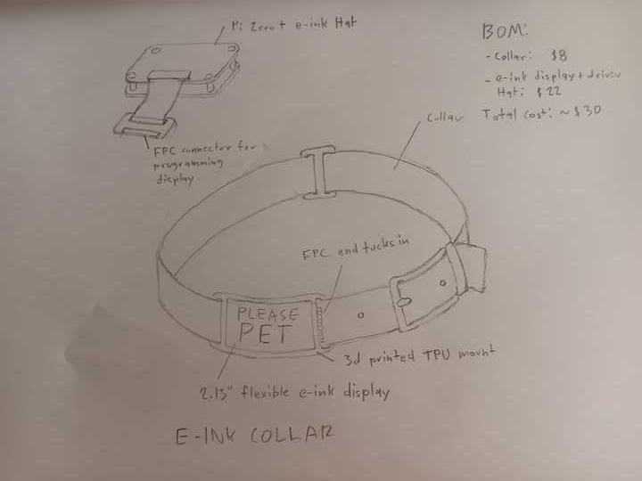

# eink-collar
A collar with an e-ink display, perfect for use as a hackathon badge! It consists of a collar with a flexible e-ink display on it, and a 
leash with a Raspberry Pi Zero and e-ink driver HAT. You can connect the leash to program it, and disconnect it to stand alone, or keep the leash connected, and somehow powered to have a dynamic collar.
You could even make a pwnagotchi collar!

## Parts:
- https://www.amazon.com/2-13inch-Flexible-Display-HAT-Raspberry/dp/B081HFWQLQ
- https://www.amazon.com/Taglory-Reflective-Adjustable-Release-Training/dp/B088QWQJW8/
- https://www.amazon.com/Taglory-Comfortable-Padded-Reflective-Threads/dp/B08CVFZVZB/ (if you want to put the electronics on a leash)
